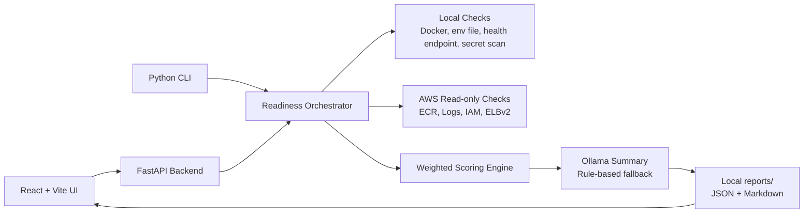

# ECS Deployment Readiness Agent

`ecs-deployment-readiness-agent` is a local-first AI-assisted DevOps tool that validates whether a Docker image and its runtime configuration are ready for Amazon ECS/Fargate deployment before an ECS service is created.

The project is designed as a production-grade portfolio project for DevOps engineers who want to demonstrate container deployment readiness, AWS operational discipline, secure configuration handling, and practical AI integration without accidentally creating chargeable cloud infrastructure.

## Problem Statement

Many ECS deployment failures are avoidable. Common issues include missing images, wrong container ports, broken health checks, invalid Fargate CPU/memory combinations, missing environment variables, hardcoded secrets, missing CloudWatch log groups, and incomplete IAM task execution roles.

In real teams, these problems are often discovered only after a pull request is approved, a deployment pipeline runs, or an ECS service starts failing health checks. This tool moves those validations earlier into a local pre-deployment readiness gate.

## Real-world Scenario

A DevOps engineer receives a Docker image from an application team and is asked:

> Is this Docker image ready for ECS deployment?

Before creating an ECS service or applying Terraform, the engineer runs the readiness agent. The agent checks local Docker metadata, env-file documentation, Fargate task sizing, secret hygiene, health check readiness, CloudWatch logging, IAM role readiness, ECR image existence, and ALB health check configuration. It then produces a JSON report, Markdown report, UI view, CLI summary, and an AI-style DevOps explanation.

## Architecture



## Features

- FastAPI backend with typed request/report models
- React + Vite frontend with dashboard, form, history, and report pages
- CLI entrypoint for automation and terminal demos
- Local, mock, and AWS read-only validation modes
- Local Ollama summarization with rule-based fallback
- Weighted scoring with high and medium severity checks
- Markdown and JSON report generation under `reports/`
- Secret masking and env var name-only reporting
- No AWS resource creation by default
- Pytest coverage for scoring, Fargate sizing, env vars, and secret masking

## Validation Checks

| Check | Severity | Local Mode | AWS Read-only Mode |
| --- | --- | --- | --- |
| Docker/ECR image exists | HIGH | `docker image inspect` | `ecr:DescribeImages` |
| Container port exposed | MEDIUM | Docker image metadata | Warning with task-definition recommendation |
| Health check works | HIGH | Optional local container probe | Configuration-level validation |
| Required env vars present | HIGH | `.env.sample` or provided file | Same local documentation file |
| Redis/Postgres documented | MEDIUM | Required deps and env hints | Same |
| Fargate CPU/memory valid | HIGH | Static ECS rules | Static ECS rules |
| Secrets not hardcoded | HIGH | Dockerfile/env/config scan | Same project-file scan |
| CloudWatch log group configured | MEDIUM | Naming convention | `logs:DescribeLogGroups` |
| IAM task execution role valid | HIGH | Role name provided | `iam:GetRole`, `iam:ListAttachedRolePolicies` |
| ALB health check path valid | MEDIUM | Path validation | Optional target group validation |

## Tech Stack

- Python 3.11+
- FastAPI
- Pydantic v2
- boto3 for AWS read-only validation
- Ollama local API for AI summaries
- React 19
- Vite
- Pytest
- Ruff and Black
- Docker Compose for local development

## Folder Structure

```text
ecs-deployment-readiness-agent/
|-- README.md
|-- docker-compose.yml
|-- .env.example
|-- .env.sample
|-- .gitignore
|-- Makefile
|-- pyproject.toml
|-- requirements.txt
|-- backend/
|   |-- app/
|   |   |-- main.py
|   |   |-- cli.py
|   |   |-- api/routes.py
|   |   |-- core/
|   |   |-- checks/
|   |   |-- aws/
|   |   |-- llm/
|   |   |-- report/
|   |   `-- storage/
|   `-- tests/
|-- frontend/
|   |-- package.json
|   |-- vite.config.js
|   `-- src/
|-- examples/
|-- docs/
`-- architecture/
```

## Prerequisites

- Python 3.11 or newer
- Node.js 20 or newer
- Docker CLI for local Docker image validation
- AWS CLI credentials only if using `aws-readonly` mode
- Ollama only if you want local AI summaries

Mock mode requires only Python dependencies and does not require Docker, AWS, or Ollama.

## Local Setup

```bash
git clone <your-repo-url>
cd ecs-deployment-readiness-agent
python -m venv backend/.venv
source backend/.venv/bin/activate
pip install -r requirements.txt
```

Windows PowerShell:

```powershell
cd ecs-deployment-readiness-agent
python -m venv backend\.venv
.\backend\.venv\Scripts\Activate.ps1
pip install -r requirements.txt
```

## Ollama Setup

```bash
ollama pull llama3.1
ollama serve
```

Environment variables:

```env
LLM_PROVIDER=ollama
OLLAMA_BASE_URL=http://localhost:11434
OLLAMA_MODEL=llama3.1
```

If Ollama is unavailable, the backend does not crash. It adds this warning to the report:

```text
Ollama unavailable, generated rule-based summary.
```

## Backend Setup

Linux/macOS:

```bash
cd backend
python -m venv .venv
source .venv/bin/activate
pip install -r ../requirements.txt
uvicorn app.main:app --host 0.0.0.0 --port 8000
```

Windows PowerShell:

```powershell
cd backend
python -m venv .venv
.\.venv\Scripts\Activate.ps1
pip install -r ..\requirements.txt
uvicorn app.main:app --host 0.0.0.0 --port 8000
```

Health check:

```bash
curl http://localhost:8000/api/health
```

## Frontend Setup

```bash
cd frontend
npm install
npm run dev
```

Open:

```text
http://localhost:5173
```

## CLI Usage

From the project root:

```bash
python -m backend.app.cli check --config examples/readiness-config.yaml
```

Expected CLI output:

```text
ECS Deployment Readiness Check
Overall status: NOT_READY
Score: 71.88%
Passed count: 7
Warning count: 1
Failed count: 2
Markdown report path: reports/readiness-report-<timestamp>.md
JSON report path: reports/readiness-report-<timestamp>.json
```

## API Usage

Run a readiness check:

```bash
curl -X POST http://localhost:8000/api/readiness/check \
  -H "Content-Type: application/json" \
  -d @examples/readiness-request.json
```

Fetch a report:

```bash
curl http://localhost:8000/api/readiness/report/<report_id>
```

Fetch a sample config:

```bash
curl http://localhost:8000/api/config/sample
```

## Example Input

```json
{
  "image": "516569236000.dkr.ecr.ap-south-1.amazonaws.com/sample-app:latest",
  "aws_region": "ap-south-1",
  "aws_profile": "default",
  "mode": "mock",
  "container_port": 8080,
  "health_check_path": "/health",
  "required_env_vars": ["DATABASE_URL", "REDIS_URL", "APP_ENV"],
  "required_dependencies": ["postgres", "redis"],
  "task_cpu": 512,
  "task_memory": 1024,
  "cloudwatch_log_group": "/ecs/sample-app",
  "task_execution_role_name": "",
  "alb_health_check_path": "/health",
  "local_env_file": ".env.sample"
}
```

## Mock Mode Demo

Mock mode is the best first demo:

```bash
python -m backend.app.cli check --config examples/readiness-config.yaml
```

It uses deterministic sample data and produces reports without Docker, AWS credentials, or Ollama.

## Local Docker Image Validation Demo

1. Build or pull a local image.
2. Change `mode` to `local` in `examples/readiness-config.yaml`.
3. Set `image` to your local image tag.
4. Keep `allow_local_container_run: false` for metadata and static validation.
5. Set `allow_local_container_run: true` only when you explicitly want the agent to run the container and probe `http://localhost:<port>/<health_check_path>`.

The agent never runs containers automatically unless that flag is true.

## AWS Read-only Mode Demo

1. Configure an AWS profile with read-only permissions.
2. Set `mode: aws-readonly`.
3. Use an ECR image URI.
4. Provide `cloudwatch_log_group`, `task_execution_role_name`, and optionally `target_group_arn`.
5. Run the CLI or UI check.

The backend only uses read APIs such as `DescribeImages`, `DescribeLogGroups`, `GetRole`, `ListAttachedRolePolicies`, and `DescribeTargetGroups`.

## IAM Read-only Policy

See [docs/aws-readonly-iam-policy.md](docs/aws-readonly-iam-policy.md).

## Scoring Logic

Each check returns:

```json
{
  "name": "Docker Image Exists",
  "status": "PASS",
  "severity": "HIGH",
  "evidence": "...",
  "recommendation": "..."
}
```

Status scoring:

- `PASS` = full points
- `WARN` = half points
- `FAIL` = zero points

Severity weighting:

- `HIGH` = 10 points
- `MEDIUM` = 5 points

Final status:

- `READY`: score >= 85 and no high-severity failures
- `READY_WITH_WARNINGS`: score >= 70 and no high-severity failures
- `NOT_READY`: score < 70 or any high-severity failure

## Security Considerations

- Secret values are never printed intentionally.
- Env checks report variable names only.
- URLs containing credentials are masked.
- Secret scans are limited to project files such as Dockerfile, env files, and selected config files.
- The scanner does not scan the whole home directory.
- AWS credentials are never written to reports.
- Docker containers are not run unless `allow_local_container_run=true`.
- AWS mode is read-only and opt-in.

## Cost Considerations

This project avoids AWS costs by default:

- No ECS service creation
- No Fargate task runs
- No ALB creation
- No RDS or Redis creation
- No CloudWatch Logs Insights queries
- No infrastructure mutation APIs

AWS read-only mode may call AWS APIs, but it does not create resources.

## Tests

```bash
pytest backend/tests
```

Coverage includes:

- Scoring logic
- Final status calculation
- Valid and invalid Fargate CPU/memory combinations
- Missing env var detection
- Secret scan masking

## Docker Compose

```bash
docker compose up --build
```

Compose starts only backend and frontend. It does not include Redis or Postgres because this project validates dependency readiness instead of requiring those services for its own runtime.

## Screenshots To Capture

1. Local UI dashboard
2. New readiness check form
3. Report page showing score
4. Generated Markdown report
5. CLI output
6. Ollama running locally
7. Optional AWS ECR image screen
8. Optional CloudWatch log group screen
9. Optional IAM role screen

## Interview Explanation

This project demonstrates how I would design a pre-deployment quality gate for ECS/Fargate. It validates the highest-risk runtime assumptions before infrastructure is created: image availability, task sizing, env vars, health checks, logs, IAM execution role, dependency documentation, secret hygiene, and ALB health path alignment.

The architecture is intentionally local-first and safe. Mock mode supports demos and CI. Local mode validates Docker and static configuration. AWS read-only mode confirms cloud-side prerequisites without creating resources. The AI summarizer is useful but not critical; if Ollama is unavailable, deterministic rule-based output keeps the tool reliable.

## Future Improvements

- Terraform plan ingestion for task definition and target group validation
- GitHub Actions workflow for pull request readiness comments
- SBOM and vulnerability scanner integration
- ECR tag immutability checks
- Task definition diffing
- Open Policy Agent policies for deployment governance
- AgentCore integration with explicit approval gates
- Slack or Jira deployment-readiness summaries

## Troubleshooting

### Backend import error

Run backend commands from the `backend/` directory:

```bash
uvicorn app.main:app --host 0.0.0.0 --port 8000
```

Run CLI commands from the project root:

```bash
python -m backend.app.cli check --config examples/readiness-config.yaml
```

### Ollama unavailable

Start Ollama:

```bash
ollama serve
```

Or continue without it. The rule-based summary fallback is automatic.

### Docker image not found

Pull or build the image:

```bash
docker pull <image>
```

or:

```bash
docker build -t sample-app:local .
```

### AWS profile not found

Confirm credentials:

```bash
aws configure list-profiles
aws sts get-caller-identity --profile <profile>
```

### Frontend cannot reach backend

Confirm the backend is running:

```bash
curl http://localhost:8000/api/health
```

The Vite dev server proxies `/api` to `http://localhost:8000`.

