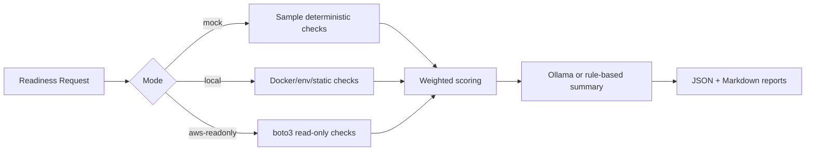

# Architecture

## Request Flow

1. A DevOps engineer submits a readiness payload from the React UI, the CLI, or a direct API call.
2. FastAPI validates the payload with Pydantic models.
3. The readiness orchestrator runs the check suite for the selected mode.
4. The scoring engine calculates a weighted readiness score and final status.
5. The summary layer calls Ollama locally. If Ollama is unavailable, it uses a rule-based summary.
6. The local report store writes Markdown and JSON reports under `reports/`.
7. The API returns the full report to the UI or CLI.

## Tool And Check Flow

## Local Mode Vs AWS Read-only Mode

Local mode never calls AWS. It validates Docker image metadata, env-file documentation, Dockerfile/config secret hygiene, Fargate task sizing, naming conventions, and optionally the local health endpoint. The container health probe is disabled unless `allow_local_container_run=true`.

AWS read-only mode uses boto3 read APIs only. It can validate ECR image existence, CloudWatch log group existence, IAM execution role policy attachment, and target group health check path when a target group ARN is supplied.

Mock mode requires no Docker, AWS credentials, or Ollama. It is intended for portfolio demos, screenshots, and CI smoke checks.

## Why No ECS Service Is Created

The tool is intentionally a pre-deployment readiness gate. It answers whether an image and deployment configuration are ready before an engineer requests approval or applies infrastructure changes. Creating ECS services, task definitions, ALBs, RDS, Redis, security groups, or log groups is outside the default execution boundary.

## Why This Avoids Unnecessary AWS Charges

The default mode is mock or local. AWS mode is opt-in and read-only. Because the tool does not create ECS services, Fargate tasks, load balancers, databases, caches, or log ingestion queries, it avoids the accidental spend that often comes from demo infrastructure left running.

## Extending To AgentCore Later

The current project has clean boundaries:

- Pydantic request and report models define the contract.
- Checks are isolated modules returning `CheckResult`.
- AWS clients are read-only wrappers.
- Summaries are provider-based.
- Reports are local artifacts.

An AgentCore implementation could add multi-step planning, approval gates, Slack/Jira integration, change-ticket generation, or Terraform plan review while keeping the same readiness check interface. Write actions should remain behind explicit approval workflows.
